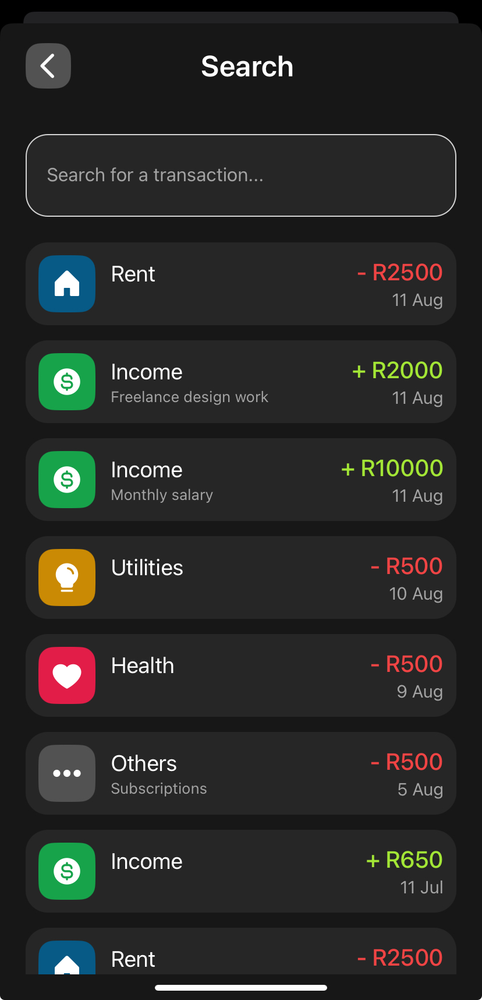

# 💰 Expense Tracker App

An **Expense Tracking** mobile application built with **Expo** and **React Native**, using **Firebase** for authentication & data storage and **Cloudinary** for image hosting.  
Easily manage multiple wallets, track expenses and incomes across various categories, and visualize your financial habits with a statistics dashboard.

---

## ✨ Features

- **Multi-Wallet Support** – Create and manage multiple wallets for different purposes.
- **Expense & Income Tracking** – Add transactions with category, amount, and optional notes/images.
- **Category Management** – Choose from predefined categories or create your own.
- **Statistics Dashboard** – View detailed charts and summaries of your spending habits.
- **Cloud Storage** – Store transaction images securely with **Cloudinary**.
- **Secure Authentication** – Firebase Authentication for secure user sign-in.
- **Cross-Platform** – Works on both Android and iOS.

---

## 📸 Screenshots

<table>
  <tr>
    <th>Welcome</th>
    <th>Register</th>
    <th>Login</th>
  </tr>
  <tr>
    <td></td>
    <td></td>
    <td></td>
  </tr>
</table>

<table>
  <tr>
    <th>Home</th>
    <th>Statistics</th>
    <th>Wallets</th>
    <th>Profile</th>
  </tr>
  <tr>
    <td></td>
    <td></td>
    <td></td>
    <td></td>
    
  </tr>
</table>

<table>
  <tr>
    <th>Add Transaction</th>
    <th>Search Transactions</th>
   
  </tr>
  <tr>
    <td></td>
    <td></td>
    
    
  </tr>
</table>

---
